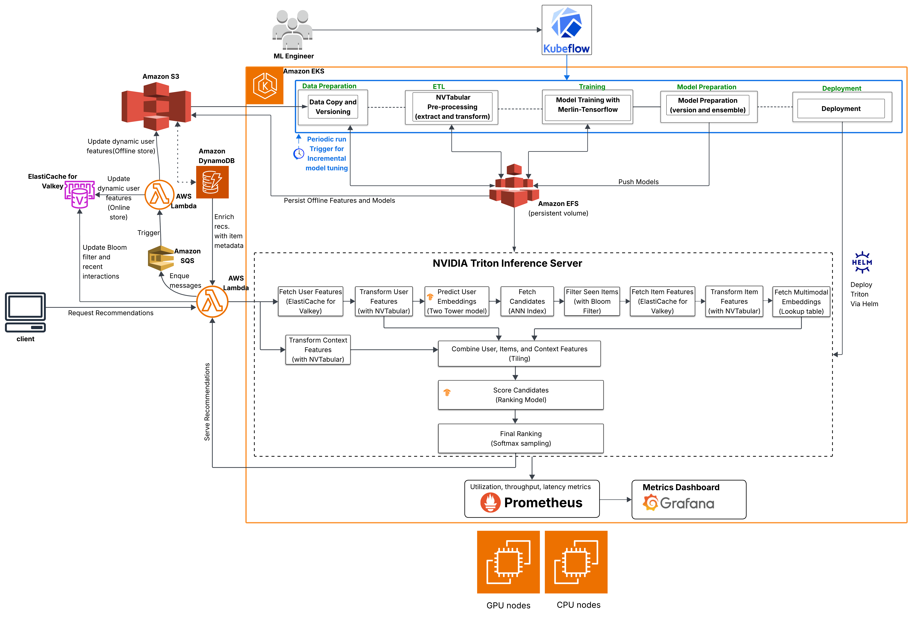

# Multistage Multimodal Recommender System on Amazon EKS

A production-grade multistage recommender system deployed on Kubernetes, combining two-tower retrieval, DLRM ranking, multimodal item embeddings, and a real-time behavioral personalization loop.  

**Model serving pipeline**

---

## MLOps Architecture


---

## Publications
1. Towards Data Science

[Deploying a Multistage Multimodal Recommender System on Amazon EKS featuring Bloom Filters, Feature Caching, and Contextual Recommendations](https://towardsdatascience.com/deploying-a-multistage-multimodal-recommender-system-on-amazon-eks-featuring-bloom-filters-feature-caching-and-contextual-recommendations)

---
## Video Demo
Click to watch the Demo
[](https://youtu.be/nNC8G7wBpBA)
## How it works

A user request triggers a 14-stage ensemble served by NVIDIA Triton Inference Server on EKS:

<!--  -->

1. **Feast user lookup** — fetches user features (age, gender, `top_category`) from a Redis online store
2. **NVT transforms** — applies the same NVTabular preprocessing workflow used during training to user, item, and context features
3. **Two-Tower retrieval** — encodes the user query and searches a FAISS index of item embeddings to retrieve the top-N candidates
4. **Bloom filter** — removes items the user has already seen using a Redis/Valkey Bloom filter
5. **Feast item lookup** — resolves item features (category, price, gender) from a numpy in-memory cache loaded at startup (~0.5ms vs ~195ms for a live Feast round trip)
6. **Multimodal embedding lookup** — attaches CLIP image and sentence-transformer text embeddings (PCA-reduced to 64-dim each) to each candidate
7. **DLRM ranking** — scores the filtered candidates; a reranker reranks and samples from the scored candidates and  results are returned to the caller enriched with DynamoDB item metadata

---

## Real-time behavioral personalization

`top_category` — the user's dominant item category over the past 24 hours — is updated in near real-time without retraining:


- When a user interacts with an item, the serving Lambda adds it to a Redis sorted set (`user:{id}:recent_items`) and enqueues an SQS message
- The `recsys-feature-computation` Lambda triggers on that message, recomputes `top_category` from the sorted set, and writes it to both the **Feast online store** (Redis) for immediate serving and the **S3 offline store** (Parquet) for the next incremental training run
- The incremental training pipeline reads the S3 offline store to override stale Feast historical features, eliminating training/serving skew for `top_category`

---

## Stack

| Layer | Technology |
|---|---|
| Model serving | NVIDIA Triton Inference Server |
| Orchestration | Amazon EKS, Karpenter, Kubernetes HPA |
| Feature store | Feast (Redis online store, S3 offline store) |
| Behavioral cache | Amazon ElastiCache (Redis/Valkey) |
| Item metadata | Amazon DynamoDB |
| Serving Lambda | AWS Lambda + Function URL |
| Real-time features | AWS SQS → Lambda → Feast + S3 |
| Training pipeline | Kubeflow Pipelines on EKS |
| Preprocessing and Training | NVIDIA NVTabular, Merlin-Tensorflow |

---

## Deployment

Full deployment instructions: [Docs/documentation.md](Docs/documentation.md)

---

## Citation 

```bibtex
@article{momoh2026multistage,
  title={Deploying a Multistage Multimodal Recommender System on Amazon Elastic Kubernetes Service},
  author={Momoh, Mustapha Unubi},
  platform={Towards Data Science},
  year={2026},
  month={May},
  url={https://towardsdatascience.com/deploying-a-multistage-multimodal-recommender-system-on-amazon-eks-featuring-bloom-filters-feature-caching-and-contextual-recommendations}
}

@Manual{momoh2026recsyseks,
  title={Multistage Multimodal Recommender System on Amazon EKS},
  author={Momoh, Mustapha Unubi},
  year={2026},
  url={https://github.com/MustaphaU/EKS_Deployment}
}
```

## Resources
- Ziyou "Eugene" Yan, [*System Design for Recommendations and Search*](https://eugeneyan.com/writing/system-design-for-discovery/), eugeneyan.com, Jun. 2021.
- Benedikt Schifferer, [*Solving the Cold-Start Problem Using Two-Tower Neural Networks for NVIDIA's E-Mail Recommender Systems*](https://medium.com/nvidia-merlin/solving-the-cold-start-problem-using-two-tower-neural-networks-for-nvidias-e-mail-recommender-2d5b30a071a4), NVIDIA Merlin (Medium), Jan. 2023.
- Justin Wortz, Justin Totten, [*Scaling Deep Retrieval with TensorFlow Recommenders and Vertex AI Matching Engine*](https://cloud.google.com/blog/products/ai-machine-learning/scaling-deep-retrieval-tensorflow-two-towers-architecture), Google Cloud Blog, Apr. 19, 2023.
- Sam Partee, Tyler Hutcherson, Nathan Stephens, [*Offline to Online: Feature Storage for Real-time Recommendation Systems with NVIDIA Merlin*](https://developer.nvidia.com/blog/offline-to-online-feature-storage-for-real-time-recommendation-systems-with-nvidia-merlin/), NVIDIA Technical Blog, Mar. 1, 2023.
- Jacopo Tagliabue, Hugo Bowne-Anderson, Ronay Ak, Gabriel de Souza Moreira, Sara Rabhi, [*NVIDIA Merlin Meets the MLOps Ecosystem: Building a Production-Ready RecSys Pipeline on Cloud*](https://medium.com/nvidia-merlin/nvidia-merlin-meets-the-mlops-ecosystem-building-a-production-ready-recsys-pipeline-on-cloud-1a16c156166b), NVIDIA Merlin (Medium), Feb. 2023.